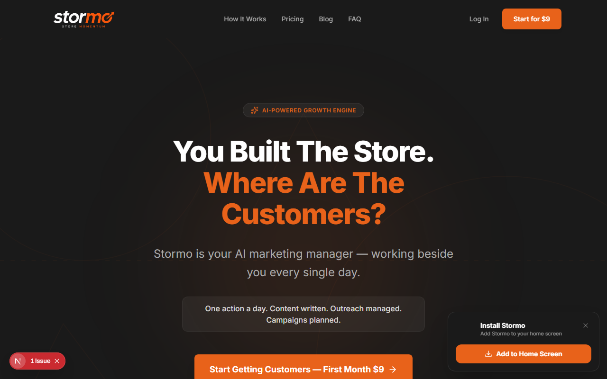
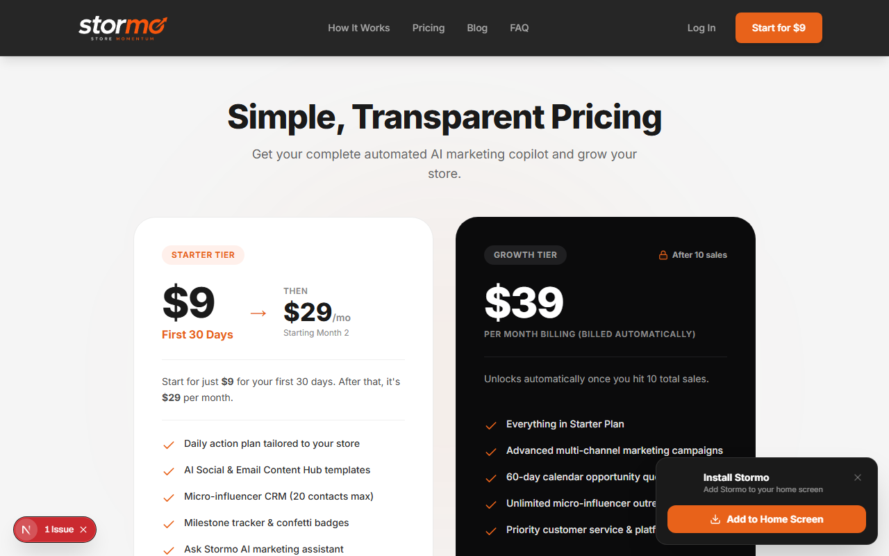
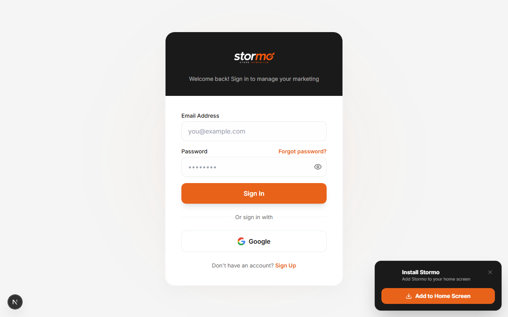
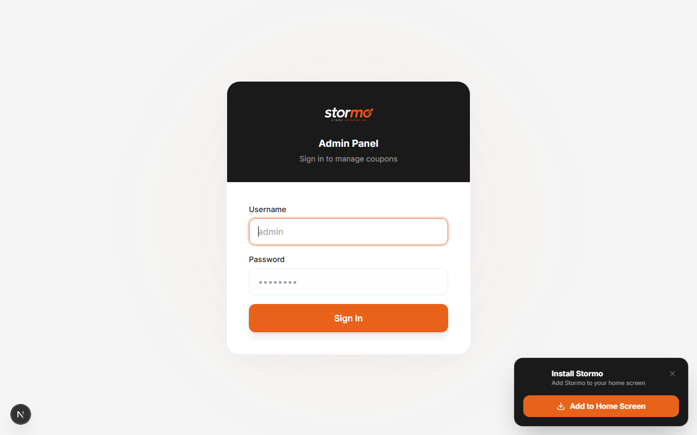

# Stormo.io — AI Marketing Manager

> **Built by [Muhammad Ismaeel](https://github.com/ismaeeldev)**

Stormo is a full-stack AI-powered marketing manager for ecommerce store owners. It generates a daily action plan, writes weekly social & email content, manages influencer outreach, and automates campaigns — all tailored to your specific store.

---

## Screenshots

### Homepage


### Pricing


### Sign In


### Admin Panel


---

## Features

- **Daily Action Plan** — One prioritised marketing action per day generated by AI based on your store profile
- **Weekly Content Hub** — Auto-generates Instagram, Reddit, Email, Pinterest, Blog and Product Description content every week
- **Micro-Influencer CRM** — Outreach tracker with AI-drafted messages and follow-up reminders
- **Campaign Planner** — 60-day calendar of marketing opportunities
- **Milestone Tracker** — Celebrates first action, first sale, and growth milestones
- **Ask Stormo** — Floating AI chat assistant available on every dashboard page
- **Coupon System** — Admin-generated codes that grant free plan access without payment
- **Stripe Subscriptions** — $9 intro month → $29/mo Starter, Growth tier unlocks at 10 sales
- **Email Verification** — Full email/password auth with verification gate before dashboard access
- **PWA** — Installable on Android and iOS, offline fallback page, push notification ready
- **Admin Dashboard** — Private `/admin` panel to create, edit and delete coupons

---

## Tech Stack

| Layer | Technology |
|---|---|
| Framework | Next.js 16 (App Router, Turbopack) |
| Language | TypeScript |
| Styling | Tailwind CSS v4 |
| Database | Neon (PostgreSQL) via Drizzle ORM |
| Auth | NextAuth v5 (Credentials + Google OAuth) |
| Payments | Stripe (Subscriptions + Webhooks) |
| AI | Anthropic Claude API |
| Email | Resend |
| Deployment | Vercel (serverless functions) |
| PWA | Custom Service Worker |

---

## Project Structure

```
stormo/
├── app/
│   ├── (admin)/          # Admin panel — coupon management
│   ├── (auth)/           # Login, register, verify email, reset password
│   ├── (dashboard)/      # Protected dashboard with sidebar layout
│   ├── (public)/         # Homepage, pricing, blog, checkout
│   └── api/              # All API routes
├── components/
│   ├── dashboard/        # Dashboard widgets and AI chat
│   ├── homepage/         # Landing page sections and navbar
│   └── pwa/              # PWA install banner and service worker provider
├── lib/
│   ├── db/               # Drizzle schema, queries, migrations
│   ├── email/            # Email templates and sender
│   ├── stripe/           # Stripe client
│   └── generators/       # AI content generators per content type
├── public/
│   ├── icons/            # PWA icons (192×192, 512×512, apple-touch)
│   ├── screenshots/      # README screenshots
│   └── sw.js             # Service worker
└── proxy.ts              # Next.js middleware (auth + admin gate)
```

---

## Getting Started

### Prerequisites

- Node.js 18+
- A Neon (PostgreSQL) database
- Stripe account with products configured
- Resend account for transactional email
- Anthropic API key
- Google OAuth credentials (optional)

### Environment Variables

Create a `.env.local` file:

```env
# Database
DATABASE_URL=

# NextAuth
NEXTAUTH_SECRET=
NEXTAUTH_URL=http://localhost:3000
NEXT_PUBLIC_APP_URL=http://localhost:3000

# Google OAuth (optional)
GOOGLE_CLIENT_ID=
GOOGLE_CLIENT_SECRET=

# Stripe
STRIPE_SECRET_KEY=
STRIPE_WEBHOOK_SECRET=
STRIPE_PRICE_STARTER_INTRO=     # $9 first month price ID
STRIPE_PRICE_STARTER=           # $29/mo price ID
STRIPE_PRICE_GROWTH=            # $39/mo price ID

# Anthropic
ANTHROPIC_API_KEY=

# Resend
RESEND_API_KEY=
RESEND_FROM_EMAIL=

# Admin Panel
ADMIN_JWT_SECRET=
ADMIN_SETUP_SECRET=
```

### Install & Run

```bash
npm install
npm run dev
```

Open [http://localhost:3000](http://localhost:3000)

### Database Migration

```bash
npx drizzle-kit push
```

### Create Admin Account

After deployment, create your admin account once via the developer setup endpoint:

```bash
curl -X POST https://your-domain.com/api/admin/setup \
  -H "Content-Type: application/json" \
  -d '{"secret":"YOUR_ADMIN_SETUP_SECRET","username":"admin","password":"yourpassword"}'
```

Then access the admin panel at `/admin/login`.

---

## Deployment

Optimised for **Vercel** — push to `main` and it auto-deploys.

```bash
git push origin main
```

Set all environment variables in your Vercel project settings and point your Stripe webhook to:

```
https://your-domain.com/api/stripe/webhook
```

---

## Author

**Muhammad Ismaeel**
- GitHub: [@ismaeeldev](https://github.com/ismaeeldev)
- Email: m.ismaeel.developer@gmail.com

---

## License

Private project. All rights reserved © 2026 Stormo.io
